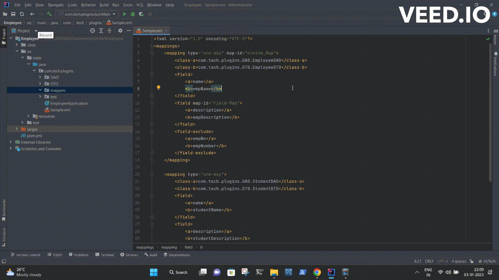

# MapStruct Plugin

### About
  As we all know mapstruct  library can generate bean mapper classes automatically.This plugin helps in generating code for mapstruct
that need to be placed above the conversion methods declared in mapper interface. 

### steps to add this plugin to ur ide
Click *Ctrl+Alt+s* shortcut on Intellij IDE to go plugins.
Go to *install from disk* options.
Import the downloaded  jar from disk.  

### How to Use The Plugin
- Select the xml code.
- press *Shift + `* shortcut  and provide the details.
- Code will be generated at the specified location.

