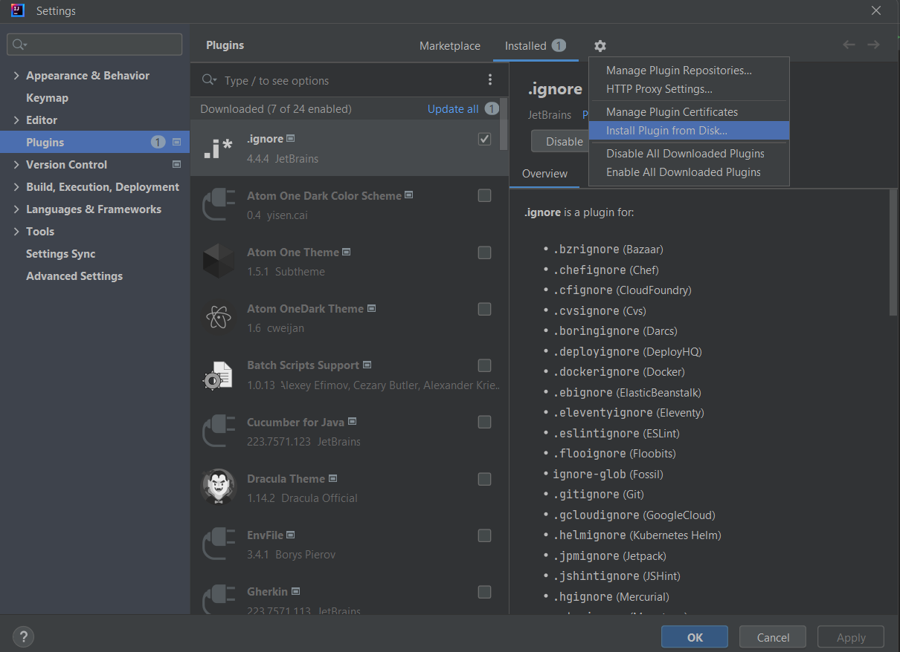

# MapStruct Plugin
Go to [plugin](build/idea-sandbox/plugins/MapStructPlugin/lib) to download jar file


### steps to add this plugin to ur ide
Click *Ctrl+Alt+s* shortcut on Intellij IDE to go plugins.
Go to *install from disk* options.
Import the downloaded  jar from disk. <br>


### How to Use The Plugin
- Select the xml code.
- press *Shift + `* shortcut On Xml , then code generated is on your clipboard.

> Note : works following  xml Structure only  . Replace *?*  accordingly

```xml
<?>
<class-a> classname </class-a>
<class-b> classname </class-b>
<field>
<a>?</a>
<b>?</b>
</field>
.... //any number of fields
<field>
<a>?</a>
<b>?</b>
</field>  

<field-exclude>
<a>?</a>
<b>?</b>
</field-exclude>
.... //any number of field-excludes
<field-exclude>
<a>?</a>
<b>?</b>
</field-exclude>  
<?>
```
