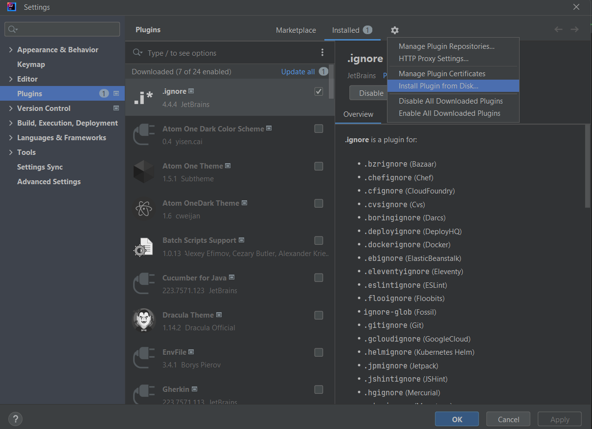
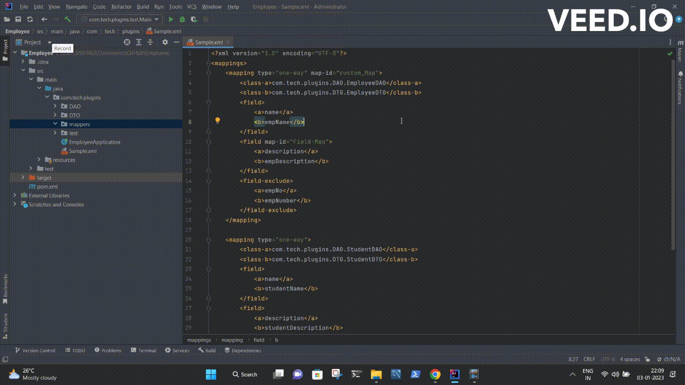

# MapStruct Plugin

## About

When it comes to modernizing the applications, migrating to Mapstruct from Dozer mapper is a primary part for most of the Java enterprise applications that are running sucessfully for more than a decade.

This Intellij plugin will help us to do the migration faster by generating mapstruct code for the dozer xml.

## Steps to add this plugin to ur ide

Click Ctrl+Alt+s shortcut on Intellij IDE to go plugins.
Go to install from disk options.
Import the downloaded  jar from disk.  

## How to Use The Plugin
- Select the xml code.
- press Shift + ` shortcut  and provide the details.
- Code will be generated at the specified location.

## Support

If you find things to be improved, feel free to make your contributions by raising issues/PRs.