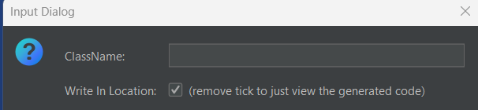
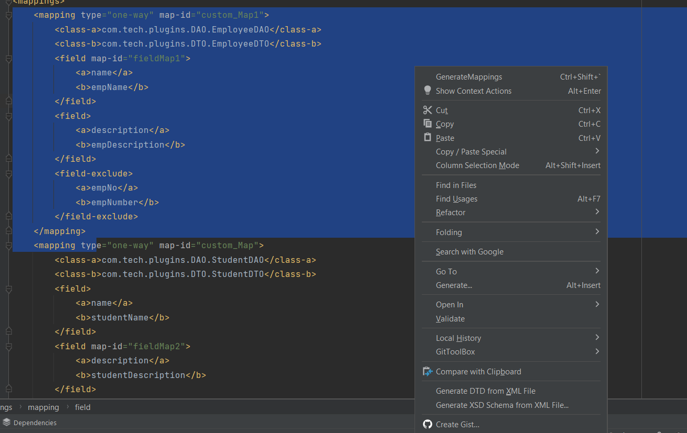
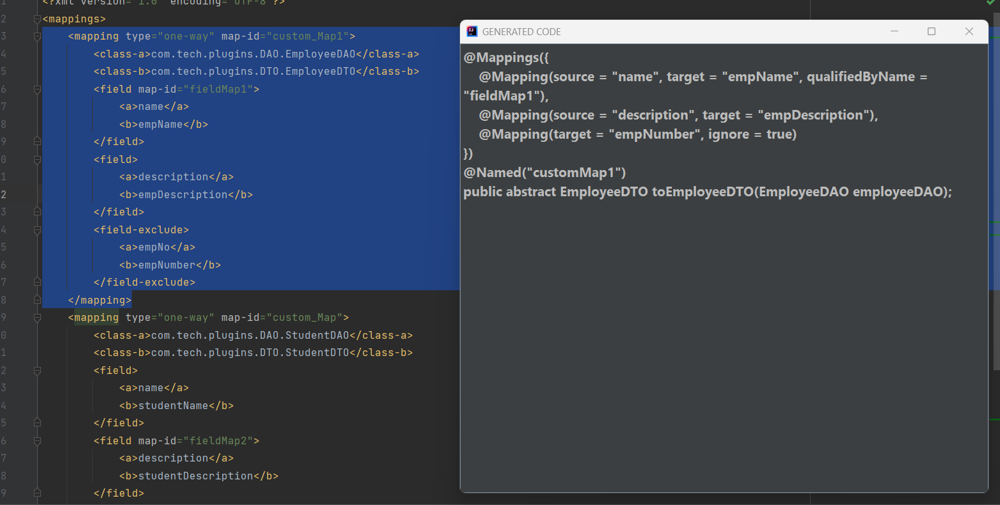

# MapStruct Plugin

## About

When it comes to modernizing the applications, migrating to Mapstruct from Dozer mapper is one of the primary part for most of the Java enterprise applications that are running successfully for more than a decade.

This Intellij plugin will help us to do the migration faster by generating mapstruct code for the dozer xml.

## Steps to add this plugin to ur ide
- It's available in jetbrains [market place](https://plugins.jetbrains.com/plugin/20853-dostruct/versions).
- Compatible versions are 2022.2 and above only.

## How to Use The Plugin
- Select the xml code.
- press Ctrl + Shift + ` shortcut  and provide the details.
- Code will be generated at the specified location.
- Map-id at field levels are added. 

- Uncheck the checkBok to avoid writing and just view the generated code in pop up.
- If the shortcut is not working, go to action by pressing (`⌘+Shift+A` or `Ctrl+Shift+A`)  and change the shortcut by yourself.

Alternate, 
- Just right click on selected text click on *GenerateMapping*  which appears first on popup menu. 

 

## Support

If you find things to be improved, feel free to make your contributions by raising issues/PRs.